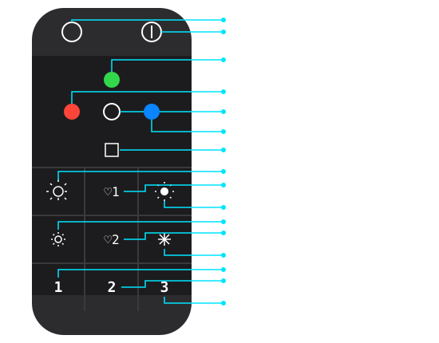

# EGLO 99099 Remote - Zigbee2MQTT RGB-CCT Blueprint

Mit diesem Blueprint lässt sich die EGLO 99099 Fernbedienung (via Zigbee2MQTT) mühelos in Home Assistant integrieren, um RGB-CCT LED-Streifen zu steuern. Die Einrichtung ist speziell für Einsteiger optimiert.

## Voraussetzungen
* Home Assistant (aktuelle Version)
* Zigbee2MQTT (Z2M) eingerichtet
* EGLO 99099 Fernbedienung (verbunden via Z2M)
* Kompatibles RGB-CCT Leuchtmittel (Entität `light.*`)

## Installation in Home Assistant

Öffne das Terminal (SSH) in Home Assistant und lade das Blueprint mit folgendem Befehl direkt in dein System herunter:

```bash
curl -o /config/blueprints/automation/eglo_99099_rgbcct.yaml [https://raw.githubusercontent.com/Schmidtjanroman/ELGO-99099-HASS-Z2M/main/eglo_99099_rgbcct.yaml](https://raw.githubusercontent.com/Schmidtjanroman/ELGO-99099-HASS-Z2M/main/eglo_99099_rgbcct.yaml)

````




